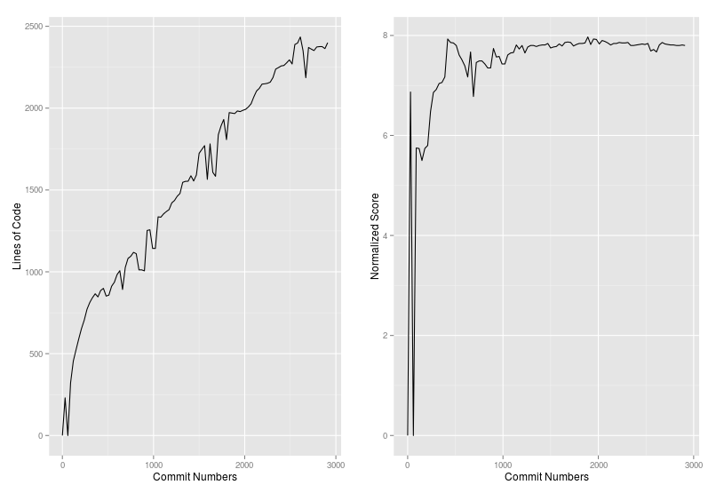
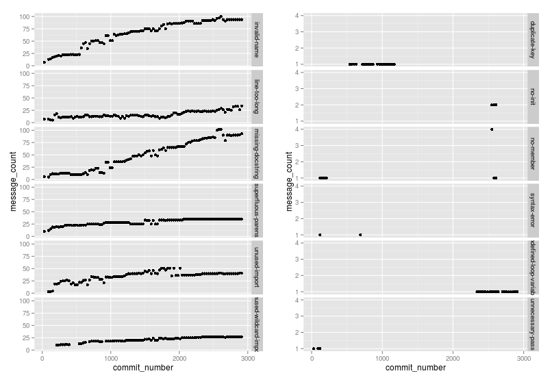

#Analyzing the changes in the coding standards throughout the life cycle of the project.

####Introduction
For each programming language, there are some coding conventions and style guides that are defined which help to structure your code better. Examples of some of the famous coding standards are [PEP 8](https://www.python.org/dev/peps/pep-0008) for Python and [Oracle's Guide](http://www.oracle.com/technetwork/java/codeconvtoc-136057.html) for Java. Following the coding conventions ensures better code quality and readability. Also, it helps to maintain a consistency in coding pattern throughout the organization or  particular project. In open source projects, it is very hard to maintain these standards as there are many collaborators. This sometimes makes the code hard to understand for new contributors. The goal of this project is to analyze how these standard change over the life-cycle of the project. This report provides several analysis of famous git hub repositories taking into account different matrix. 

####Data Set
10 famous Python repositories are selected and forked from Github. Selection criteria is based on current trends and Number of forks  for Repos. Following is the list of repos: 

10 repositories are selected based on trends of Last month. Following are there git hub URL:

- https://github.com/pydata/pandas.git
- https://github.com/reddit/reddit.git
- https://github.com/taigaio/taiga-back.git
- https://github.com/jonathanslenders/python-prompt-toolkit.git
- https://github.com/jiaaro/pydub.git
- https://github.com/django/django.git
- https://github.com/schematics/schematics.git
- https://github.com/neurokernel/neurokernel.git
- https://github.com/rg3/youtube-dl.git
- https://github.com/datamade/usaddress.git

10 repositories are selected based on Most forked python repositories on github.

- https://github.com/tornadoweb/tornado.git
- https://github.com/scrapy/scrapy.git
- https://github.com/ipython/ipython.git
- https://github.com/divio/django-cms.git
- https://github.com/faif/python-patterns.git
- https://github.com/gregmalcolm/python_koans.git
- https://github.com/matplotlib/matplotlib.git
- https://github.com/edx/edx-platform.git
- https://github.com/simplegeo/python-oauth2.git
- https://github.com/fabric/fabric.git

####Pylint
There are several parsers available for different languages that analyze the code for bad coding styles and gives you detailed report. I have used [Pylint](http://www.pylint.org/) to analyze some 10 famous Python repositories. When you parse a python package using Pylint, it gives you error and warning messages along with their count. Some examples of error messages are checking line-code's length, checking if variable names are well-formed according to PEP 8 coding standard, checking if imported modules are used, etc.It also provides you a Normalized Overall code **score out of 10.0**.

####Analysis of the repositories
In this section, I provide analysis results after running Pylint on projects. 

For each repo, 100 commits are selected as checkpoints. For e.g if you have 5000 commits in the project, you place a checkpoint after each 50 commit. Then Pylint is run on code at each checkpoint.

Below are the two plot - 1. Lines of code at each checkpoint & 2. Overall code score Normalized by Number of lines of code over the life cycle. It can be observed from the plot, that there is very little change in the overall code score throughout the life cycle. Even as the number of lines of code increase, the error messages and warnings also increase along with that.

This motivates us to analyze the code on more fine grain level. By checking the error messages at each checkpoint, it was discovered that the nature of errors and warning is diverse. It can be easily deduced from the plot below that there are broadly 2 different types of error messages- there are some that persist throughout the life-cycle of the project and others which appear at some point, and then are fixed.

At each checkpoint, there are large number of error messages. Currently I am showing only top-6 and bottom-6 messages in the below plot.

* Messages with highest frequency:
    * invalid-name
    * missing-docstring
    * unused-import
    * superfluous-parens
    * unused-wildcard-import
    * line-too-long
* Messages with lowest frequency:
    * syntax-error
    * unnecessary-pass
    * no-init
    * no-member
    * duplicate-key
    * undefined-loop-variable

####Conclusion
Need to get some feedback from professor.
