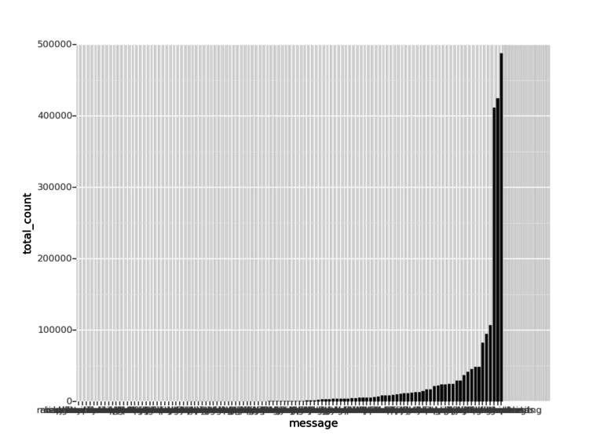

#Analyzing the changes in the coding standards throughout the life cycle of the project.
Nirmesh Khandelwal

####Introduction
For each programming language, there are some coding conventions and style guides that are defined, which helps to structure your code and provide better readability. Examples of some of the famous coding standards are [PEP 8](https://www.python.org/dev/peps/pep-0008) for Python and [Oracle's Guide](http://www.oracle.com/technetwork/java/codeconvtoc-136057.html) for Java. Following the coding conventions ensures better code quality and readability. Also, it helps to maintain a consistency in coding pattern throughout the organization. 

In open source projects, it is difficult to maintain these standards as there are many collaborators. This sometimes makes the code hard to understand for new contributors. The goal of this project is to analyze how the coding style changes over the life-cycle of the project. This report provides several analysis of famous git hub repositories taking into account different metrics. 

For most of the languages, there are tools available that scan the code and gives different warnings related to coding styles. The project attempts to identify the type of warnings that occur during different stages of the project. Also, some of the warnings may be less important then others. Apart from observing the nature of these warnings, this analysis tries to provide an efficient way prioritize them.

####Introduction to Pylint
There are several parsers available for different languages that analyze the code for bad coding styles and gives you detailed report. I have used [Pylint](http://www.pylint.org/). Pylint is python based tool that helps in finding these warnings for python language. When you parse a python package using Pylint, it gives you error and warning messages along with their count and position of particular warning message in the code. Some of the uses of Pylint are checking line-code's length, checking if variable names are well-formed according to PEP 8 coding standard, checking if imported modules are used, etc. 

It also provides you a **Normalized score for the code out of 10.0**.

####Data Collection
In order to collect the sufficient data for my analysis, I have selected below mentioned repositories from github.
The selection is based on 'trending this month' and 'Most forked repositories', for Python language. One can easily search on github based on these 2 criteria. For the list of selected repositories, check reference [3]. After downloading these repositories, we further collect data by running Pylint on code base. 

For each repo, 100 commits are selected as checkpoints. For e.g if you have 5000 commits in the project, you place a checkpoint after each 50 commit. Then Pylint is run on code at each checkpoint. This In order to persist the warning dat, we parse the messages given by Pylint and store them in MySQL db.

####Analysis of the repositories
In this section, I provide results of different analysis performed on the final data collected after running Pylint on projects. 

Below are the two plot - 1. Lines of code at each checkpoint & 2. Overall code score Normalized by Number of lines of code over the life cycle. It can be observed from the plot, that there is very little change in the overall code score throughout the life cycle. Even as the number of lines of code increase, the error messages and warnings also increase along with that.

*Figure 1. Left side plot shows how the number of lines of code increase over the life cycle of [Fabric](https://github.com/fabric/fabric.git) project. Right side plot is the Normalized code score for the same project. It can be seen from this plots that there is very little change in the overall quality of coding standard during the life cycle once the project crosses its first few hundred commits.*

This motivates us to analyze the code on more fine grain level. By checking the error messages at each checkpoint, it was discovered that the nature of errors and warning is diverse. It can be easily deduced from the plot below that there are broadly 2 different types of error messages- there are some that persist throughout the life-cycle of the project and others which appear at some point, and then are fixed.

At each checkpoint, there are large number of error messages. Currently I am showing only top-6 and bottom-6 messages in the below plot for 'fabric' repository. **Similar patterns are observed across all the other repositories also**.

*Figure 2. Left plot shows top-6 messages for 'fabric' project which persists throughout the life cycle of project. Right plot shows bottom-6 error messages for same project. It can be clearly seen that these messages appear and disappear at different instances.*

####Prioritizing warnings based on the above analysis.

This part is extension to the original project. The above analysis gives us motivation to prioritize these warning messages based on there behavior. Since the Pylint and other such tools throw large number of warnings (roughly 50-60 warnings at each commit), it becomes necessary to prioritize them.[1] The idea here is that the warnings that persists throughout the life cycle are probably less important since nobody cares to fix them. Those warnings that appear only at few checkpoints, are high priority since they were fixed by someone. 

Similar work has been done by Sunghun Kim and Michael D. Ernst[1]. But their approach was to compare the code line by line for each consecutive commits. That is computationally very expensive, specially for large projects which have more than 5K commits. The current approach in this project is computationally much more efficient since we are only analyzing the project for 100 chosen checkpoint commits.

######Experimentation

In order to check the feasibility of deciding priorities, I plotted the count of each warning messages across all the projects.

*Figure 3. The above plot shows the count of warning messages summed for each repo. It can be clearly seen that there are sum warnings that have huge count. These warnings might be the one with less priority, since people are ignoring them. Sunghun Kim and Michael D. Ernst[1], also generated similar results in their work for Prioritizing Warning Categories*.

The above plot was just to check the feasibility of the analysis. In order to get accurate results, we need more concrete method.

So I moved further by calculating the maximum streak of each warning message in the projects. Maximum streak of warning message is the number of consecutive checkpoints the error message occurs continuously. For e.g, A warning message 'x' appears consecutively for 10 checkpoints, and then disappears, and then reappears for 3 consecutive commits. In this case, we take the maximum of (10,3) to be highest streak of error message 'x' for that particular project.

For each project, we find 20 highest priority warnings and 20 lowest priority warnings. In order to combine the results from all the projects, we take **support count of each message**. For e.g if warning message 'line-too-long' is identified among top 20 High priority warnings across 6 projects, its support is 6 for High Priority classification` .

Below are the results of this analysis:

**Messages with Highest priority**:

|Warning Message    |Support Count |
|-------------------|--------------|
|syntax-error   |7  |
|bad-indentation    |5  |
|mixed-indentation  |5  |
|undefined-variable |3  |
|bad-classmethod-argument   |3  |
|catching-non-exception |2  |
|undefined-all-variable |2  |
|bad-super-call |2  |
|signature-differs  |2  |
|access-member-before-definition    |2  |
*Table 1. The above table shows 10 highest priority warning messages along with their support count. Support count of a message is number of projects it occurs as the high priority message.*

**Messages with lowest priority**:

|Warning Message    |Support Count |
|-------------------|--------------|
|unused-variable    |10  |
|line-too-long  |10  |
|unused-import  |10  |
|missing-docstring  |10  |
|too-many-arguments |9  |
|invalid-name   |6  |
|wildcard-import    |4  |
|unused-argument    |4  |
|bad-whitespace |3  |
|broad-except   |3  |
*Table 2. The above table shows 10 lowest priority warning messages along with their support count. Support count of a message is number of projects it occurs as the low priority message.*

It can be clearly seen from the above analysis, that it it possible to prioritize the warning messages with this simple and efficient method. In order to be more sure about the results, we need to further analyze large number of repositories.

####Conclusion

It can be concluded from above observations and experiments, that some interesting patterns exist in the coding styles of open source projects. It is possible to categorize the warnings given by checkstyle tools. There are some messages that persists throughout the life cycle of project, while others appear only at few instance. Based on this, it is even possible to prioritize these warning messages. The priorities assigned to error messages may help organizations to filter large number of warning messages given by checkstyle tools.

####References

1. [Prioritizing Warning Categories by Analyzing Software History](https://github.ncsu.edu/CSC510-Fall2014/Empirical-CheckStyle/blob/master/papers/Warnings.pdf?raw=true)

2. [Pylint for python code analysis ](http://www.pylint.org/)

3. List of python repositories on gitHub used for this analysis:
    - [Pandas](https://github.com/pydata/pandas.git)
    - [Reddit](https://github.com/reddit/reddit.git)
    - [Fabric](https://github.com/fabric/fabric.git)
    - [Django](https://github.com/django/django.git)
    - [Neurokernals](https://github.com/neurokernel/neurokernel.git)
    - [Youtube-dl](https://github.com/rg3/youtube-dl.git)
    - [Pydub](https://github.com/jiaaro/pydub.git)
    - [Tornado](https://github.com/tornadoweb/tornado.git)
    - [Scrapy](https://github.com/scrapy/scrapy.git)
    - [Ipytho](https://github.com/ipython/ipython.git)
    - [Matplotlib](https://github.com/matplotlib/matplotlib.git)
    - [Python Koans](https://github.com/gregmalcolm/python_koans.git)
    
